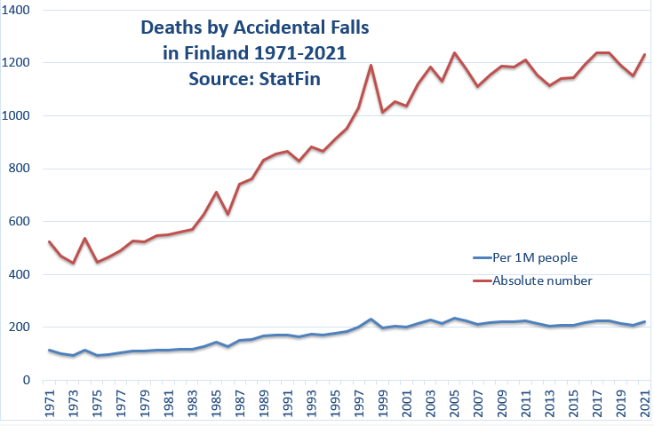

# Fall detection
In Finland, having 5.5 million people, the yearly mortality rate due to accidental falls is around 1200 persons. Many of these deaths are happening at home, some of them are happening outside. The reasons for the falls are varying, but what is clear is that the older a person gets, the higher the risk is that she/he first of all falls, and secondly that the fall might be fatal.

As the population gets older and older, 

 